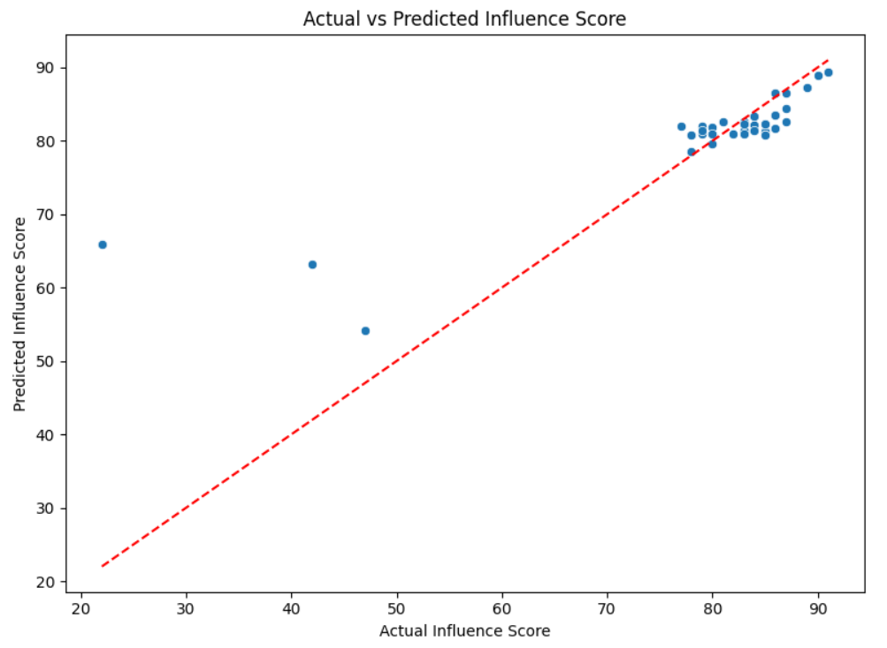
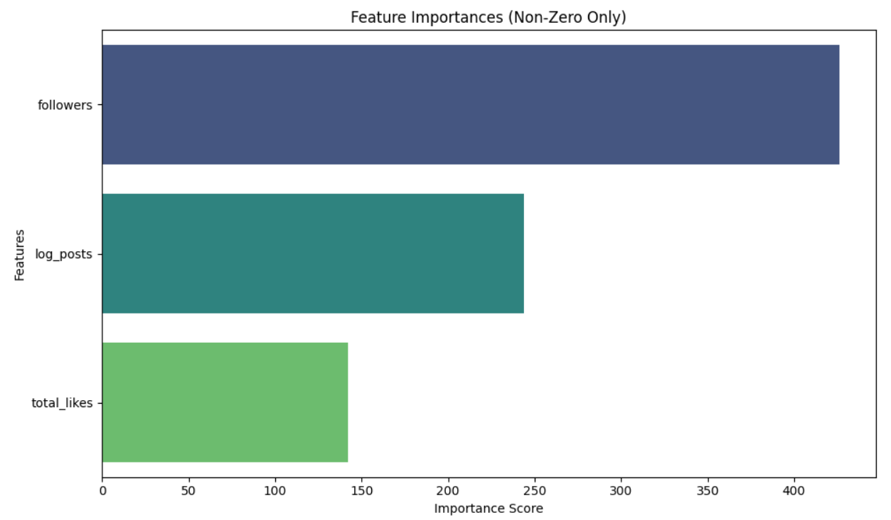

# Top_Instagram_Influencers
## Project Summary: Instagram Influencer Influence Score Prediction
**Objective:** To predict an influencer’s influence_score based on their follower metrics, engagement statistics, and country of origin.

## Dataset:
**Total influencers:** 200

**Features:** Posts, Followers, Likes, Engagement Rate, Country, etc.

**Target:** influence_score

## Workflow:
**EDA:** Explored engagement rates, like patterns, and country distribution

**Feature Engineering:** Created ratios, log-transformed variables, categorized influence level

**Modeling:** Linear Regression, Random Forest, Gradient Boosting, Lasso, Ridge

**Best Model:** Gradient Boosting Regressor

Hyperparameter Tuning using GridSearchCV

## Best Model Performance:
**Model:** Tuned Gradient Boosting Regressor

**Best Params:** n_estimators=50, max_depth=3, learning_rate=0.05, subsample=1.0

**R² Score:** 0.606

**MSE:** 66.59

## Key Features Influencing Influence Score:
- Followers
- Total Likes
- Log of Posts
- Country (e.g., USA, Czech Republic, Russia)

## Future Scope :
**Expand Dataset:** Use a larger and more diverse influencer dataset to enhance model robustness and generalizability.

**Text-Based Features:** Analyze post content using NLP (e.g., sentiment, hashtag analysis) to understand content impact.

**Real-Time Dashboards:** Build interactive dashboards to allow dynamic filtering and deeper insights for marketing teams.
